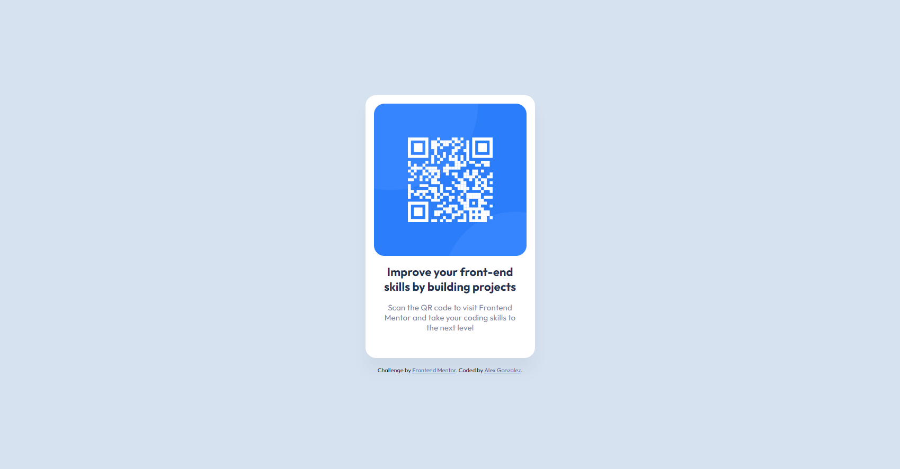

# Frontend Mentor - QR code component solution

This is a solution to the [QR code component challenge on Frontend Mentor](https://www.frontendmentor.io/challenges/qr-code-component-iux_sIO_H). Frontend Mentor challenges help you improve your coding skills by building realistic projects.

## Table of contents

- [Frontend Mentor - QR code component solution](#frontend-mentor---qr-code-component-solution)
  - [Table of contents](#table-of-contents)
  - [Overview](#overview)
    - [Screenshot](#screenshot)
    - [Links](#links)
  - [My process](#my-process)
    - [Built with](#built-with)
    - [What I learned](#what-i-learned)
    - [Continued development](#continued-development)
    - [Useful resources](#useful-resources)
  - [Author](#author)

## Overview

### Screenshot



### Links

- Solution URL: [Github Repo](https://github.com/luinrandir/qr-code-component)
- Live Site URL: [Github Live](https://luinrandir.github.io/qr-code-component/)

## My process

### Built with

- Semantic HTML5 markup
- CSS custom properties
- Flexbox
- CSS Grid
- Figma

### What I learned

This challenge provided me the opportunity to start learning the basics of Figma. Prior to using Frontend Mentor, I attempted to use Figma to create some simple svg elements,
and designs that I was using for my journey through The Odin Project. However, after starting this challenge without the use of Figma, I decided to download the file to experience
something that I might experience in a work setting. Using Figma helped out tremendously, yet even with all of the added information, I still felt a little lost finding necessary
information. Deciphering some of the Figma tools I did manage to find the sizes I needed.

Alongside Figma, I also wanted to attempt to add accessibility to this QR component. After watching some videos from Kevin Powell, I have been introduced to the concept of WAI-Aria,
and wanted to put something in my code to hopefully make it accessible. After finishing the QR component the first thought that came to mind was how to make the actual QR accessible.
From one of Kevin's videos, a reference to a CSS class helped create a hidden link that I hope will work for accessibility.

The following HTML created a span with a class of `visually-hidden` that wraps around the same link generated by the QR code.

```html
<span class="visually-hidden">
  <a href="https://www.frontendmentor.io/" target="_blank">
    Link to Frontend Mentor Site
  </a>
</span>
```

The CSS below is the `visually-hidden` class that helps hide the content, yet still make it accessible for screen readers to inform the user about the link.

```css
/* SR only */
.visually-hidden:not(:focus):not(:active) {
  clip: rect(0 0 0 0);
  clip-path: inset(50%);
  height: 1px;
  overflow: hidden;
  position: absolute;
  white-space: nowrap;
  width: 1px;
}
```
However, after completing the challenge and getting feedback, I have come to realize that sometimes simplicity is better. Even though the above code was originally added,
it was removed as using semantic HTML assisted with the accessibility. I still see the usefulness that the above code snippets can provide and hope that one day I might run
into a situation that needs them.

### Continued development

- **Accessibility**: This is something that I want to continue to improve on. Prior to starting the web dev journey, it was a concept I never really thought about. I feel that I did alright with accessibility with this challenge, yet I could improve more.
- **Custom CSS Properties**: I would like to continue to make Custom CSS Properties a tool that I always reach for. I do want to ensure that I use them meaningfully and not for the sake of just using them.
- **Semantic HTML5**: I am happy to see how far HTML has came from the time I tried to learn it in high school over 10+ years ago. I want to continue to use Semantic HTML5 especially to get better at distinguishing when to use a `<div>` vs a `Semantic Tag`.

### Useful resources

- [Kevin Powell's Channel](https://www.youtube.com/@KevinPowell) - I was fearful of CSS and never really enjoyed it. Kevin Powell's videos has made CSS not only more understandable and less frustrating, but overwhelmingly enjoyable. In fact if it were not for the channel, I never would have discovered Frontend Mentor.
- [Scott O'Hara - Inclusively Hidden](https://www.scottohara.me/blog/2017/04/14/inclusively-hidden.html) - I found this resource through a Kevin Powell video. This resource provided the `.visually-hidden` class and a well written post on how hidden items in our pages effect accessibility.

## Author

- Frontend Mentor - [@luinrandir](https://www.frontendmentor.io/profile/luinrandir)
- Github - [@luinrandir](https://github.com/luinrandir)
